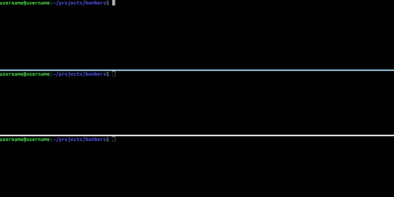

<p align="center">
    
    
    
	<a href="https://codecov.io/gh/bombers0/bombers">
    	
	</a>
	<a href="https://lgtm.com/projects/g/bombers0/bombers">
    	
	</a>
	<a href="https://lgtm.com/projects/g/bombers0/bombers">
    	
	</a>
	
	
	
</p>

# :boom: Бомберы: Перерождение


В этом репозитории создаётся ремейк Бомберов. Если желаете принять участие в разработке, пожалуйста, [ознакомьтесь](CONTRIBUTING.md).

## :cd: Установка

```bash
git clone https://github.com/bombers0/bombers.git
cd bombers
make install
```

>Команда ```make install``` - необязательная, если установка производится на сервере.

## :rocket: Запуск

### В режиме разработки

```
make run-dev TARGET=[client|mongo|app-server|game-server]
```

>client, mongo, game-server и app-server запускать в отдельных терминалах.



### На сервере

```
make build TARGET=[application|game-server]
```
